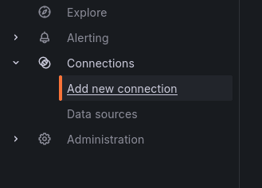
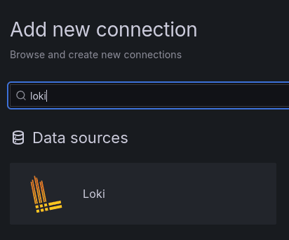
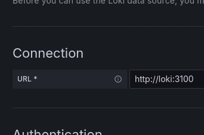
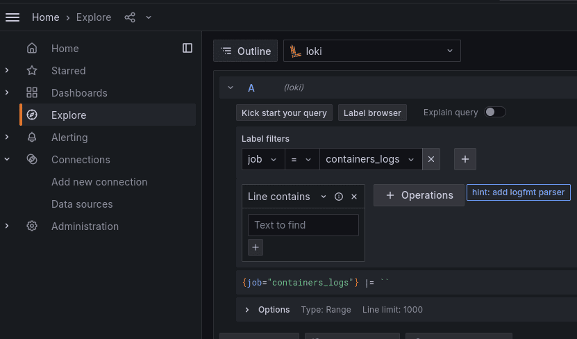
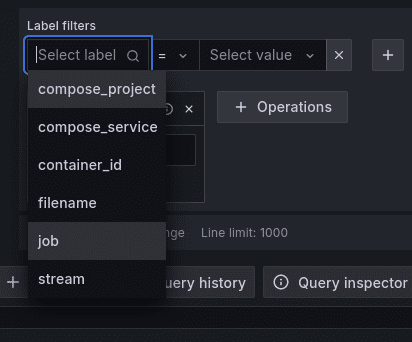
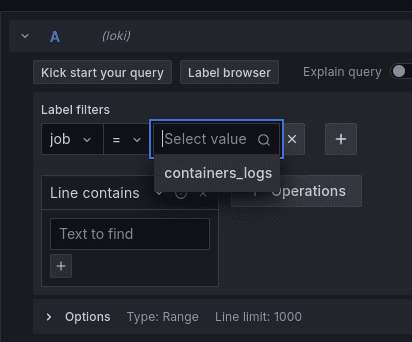
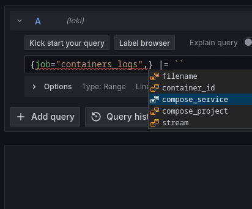
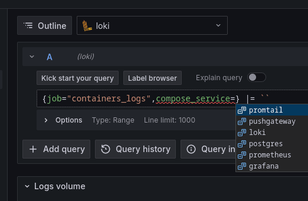

## Grafana configuration for containers logs collection

### Get started


#### Step 1. Change docker daemon

Change (or create) docker daemon config:

``sudo nano /etc/docker/daemon.json``

Change the file code (or create a file). The final result should look like this:

```
{
"log-driver": "json-file",
"log-opts": {
"labels-regex": "^.+"
}
}
```

Restart docker daemon:

``sudo systemctl restart docker``

#### Step 2. Clone and run this code

``git clone https://github.com/codesshaman/docker_grafana_prometheus_for_logging.git``

``cd docker_grafana_prometheus_for_logging``

``make build``

Wait containers start and keep calm :)

#### Step 3. Add connection to Loki

Open grafana in your host (on example of localhost):

``http://127.0.0.1:3000/``

Use ``admin:admin`` for the login and change password.

Click to "Add new connection"



Find and choose "loki"



Tap to "Add new data source"

Use ``http://loki:3100`` for default address:



Tap "Save & test"

#### Step 4. Configure the display of the necessary logs

Chose "Explorer" in left menu



Select "job" as label filter



Select "container logs" after "="



Switch from builder to code (right switcher)

Print "," after "container_logs" and choose "compose_service"



Choose necessary service for logs browsing and save



All right! Now you can see logs from your container.